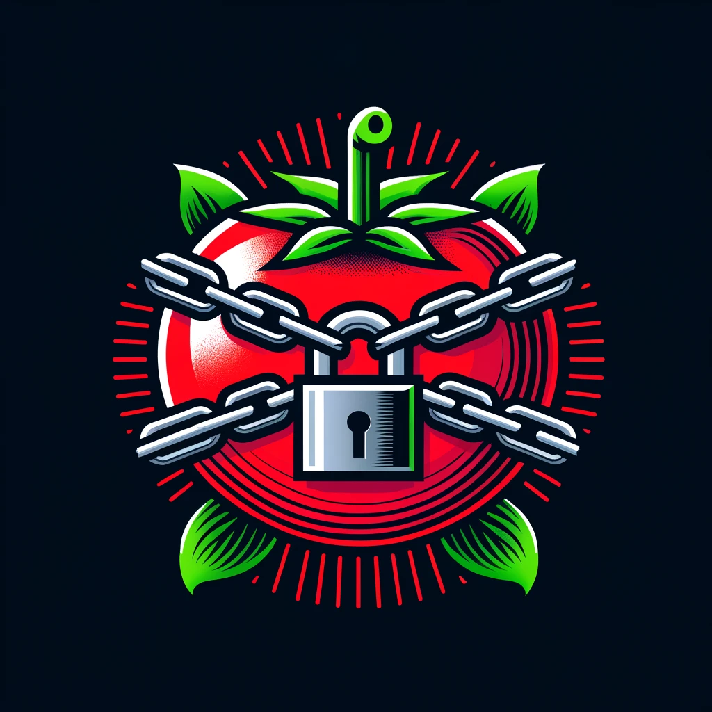
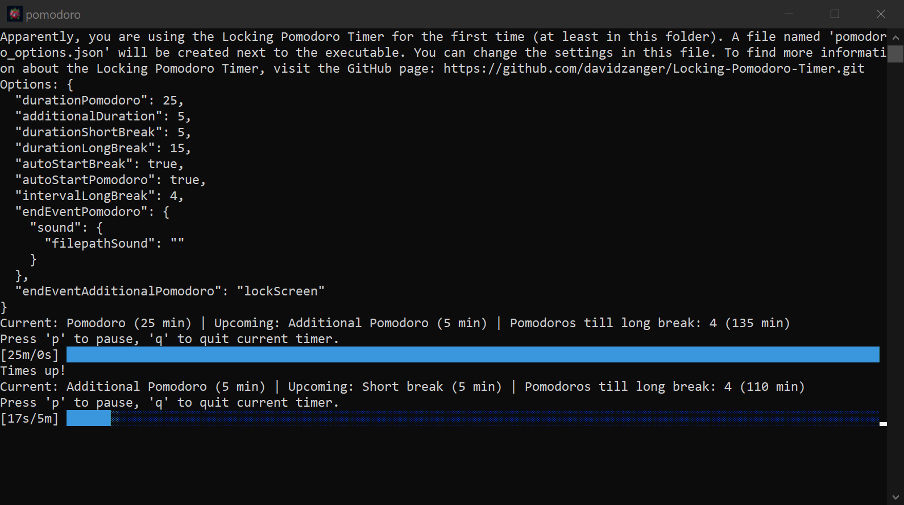

<!-- Improved compatibility of back to top link: See: https://github.com/othneildrew/Best-README-Template/pull/73 -->
<a name="readme-top"></a>
<!--
*** Thanks for checking out the Best-README-Template. If you have a suggestion
*** that would make this better, please fork the repo and create a pull request
*** or simply open an issue with the tag "enhancement".
*** Don't forget to give the project a star!
*** Thanks again! Now go create something AMAZING! :D
-->


<!-- PROJECT SHIELDS -->
<!--
*** I'm using markdown "reference style" links for readability.
*** Reference links are enclosed in brackets [ ] instead of parentheses ( ).
*** See the bottom of this document for the declaration of the reference variables
*** for contributors-url, forks-url, etc. This is an optional, concise syntax you may use.
*** https://www.markdownguide.org/basic-syntax/#reference-style-links
-->
[![Contributors][contributors-shield]][contributors-url] [![Forks][forks-shield]][forks-url] [![Stargazers][stars-shield]][stars-url] [![Issues][issues-shield]][issues-url] [![MIT License][license-shield]][license-url] [![LinkedIn][linkedin-shield]][linkedin-url]


<!-- PROJECT LOGO -->
<br />
<div align="center">
  <a href="https://github.com/davidzanger/Locking-Pomodoro-Timer">
    
  </a>

<h3 align="center">Locking Pomodoro Timer</h3>

  <p align="center">
    A Pomodoro timer with the capability of locking the screen.
    <br />
    <a href="TODO"><strong>Explore the docs »</strong></a>
    <br />
    <br />
    <a href="https://github.com/davidzanger/Locking-Pomodoro-Timer/issues/new?labels=bug&template=bug-report---.md">Report Bug</a>
    ·
    <a href="https://github.com/davidzanger/Locking-Pomodoro-Timer/issues/new?labels=enhancement&template=feature-request---.md">Request Feature</a>
  </p>
</div>


<!-- TABLE OF CONTENTS -->
<details>
  <summary>Table of Contents</summary>
  <ol>
    <li>
      <a href="#about-the-project">About The Project</a>
      <ul>
        <li><a href="#built-with">Built With</a></li>
      </ul>
    </li>
    <li>
      <a href="#getting-started">Getting Started</a>
      <ul>
        <li><a href="#prerequisites">Prerequisites</a></li>
        <li><a href="#installation">Installation</a></li>
      </ul>
    </li>
    <li><a href="#usage">Usage</a></li>
    <li><a href="#roadmap">Roadmap</a></li>
    <li><a href="#contributing">Contributing</a></li>
    <li><a href="#license">License</a></li>
    <li><a href="#contact">Contact</a></li>
    <li><a href="#acknowledgments">Acknowledgments</a></li>
  </ol>
</details>

<!-- ABOUT THE PROJECT -->
## About The Project



There are many Pomodoro timers available on the web, however, I couldn't find one that would lock the screen. I wanted to create a simple Pomodoro timer that would lock the screen after a certain amount of time as just a sound notification wasn't enough to really stop me working.
The [Pomodoro technique](https://en.wikipedia.org/wiki/Pomodoro_Technique) is a time management method that uses a timer to break down work into intervals, traditionally 25 minutes in length, separated by short breaks. This technique is used to improve focus and productivity.

### Built With

[![Rust][Rust]][Rust-url]

<p align="right">(<a href="#readme-top">back to top</a>)</p>

<!-- GETTING STARTED -->
## Getting Started

### Download Executable

The easiest way to use the Pomodoro timer is to download the executable from the [releases](TODO) page and run it on your machine.
If you want to build the project yourself, follow the instructions below.

### Prerequisites

Install Rust by following the instructions on the [Rust website](https://www.rust-lang.org/tools/install).

### Installation

1. Clone the repo

   ```sh
   git clone https://github.com/davidzanger/Locking-Pomodoro-Timer.git
   ```

2. Build the project

   ```sh
   cargo build --release
   ```

3. Use the executable which can be found in the `target/release` directory.

<p align="right">(<a href="#readme-top">back to top</a>)</p>


<!-- USAGE EXAMPLES -->
## Usage

To use the Pomodoro timer, simply run the executable. On the first run, the program will create a `.json` file next to the executable which will store the settings for the timer. The settings can be changed by editing the `.json` file.

The default settings are as follows:

```json	
{
    // The duration of a single Pomodoro session in minutes.
    "durationPomodoro": 25,
    // The additional duration in minutes to be added to a Pomodoro session when it is over.
    "additionalDuration": 5,
    // The duration of a short break in minutes.
    "durationShortBreak": 5,
    // The duration of a long break in minutes.
    "durationLongBreak": 15,
    // Flag indicating whether to automatically start a break after a Pomodoro session ends.
    "autoStartBreak": true,
    // Flag indicating whether to automatically start a new Pomodoro session after a break ends.
    "autoStartPomodoro": true,
    // The interval in number of Pomodoro sessions after which a long break should be taken.
    "intervalLongBreak": 4,
    // The end event to be executed after a Pomodoro session ends.
    "endEventPomodoro": {
        "sound": {
            "filepathSound": ""
        }
    },
    // The end event to be executed after the additional Pomodoro after a Pomodoro session ends.
    "endEventAdditionalPomodoro": "lockScreen"
}
```

For the `endEventPomodoro` and `endEventAdditionalPomodoro` fields, the following options are available:

- `sound`: Play a sound file. The path to the sound file must be provided in the `filepathSound` field. If the path is empty, the default sound will be played.
- `lockScreen`: Lock the screen. This feature is currently only available on Windows.

_For more details, please refer to the [Documentation](TODO)_

<p align="right">(<a href="#readme-top">back to top</a>)</p>

<!-- ROADMAP -->
## Roadmap

- [ ] Create a GUI for the timer.

See the [open issues](https://github.com/davidzanger/Locking-Pomodoro-Timer/issues) for a full list of proposed features (and known issues).

<p align="right">(<a href="#readme-top">back to top</a>)</p>


<!-- CONTRIBUTING -->
## Contributing

Contributions are what make the open source community such an amazing place to learn, inspire, and create. Any contributions you make are **greatly appreciated**.

If you have a suggestion that would make this better, please fork the repo and create a pull request. You can also simply open an issue with the tag "enhancement".
Don't forget to give the project a star! Thanks again!

1. Fork the Project
2. Create your Feature Branch (`git checkout -b feature/AmazingFeature`)
3. Commit your Changes (`git commit -m 'Add some AmazingFeature'`)
4. Push to the Branch (`git push origin feature/AmazingFeature`)
5. Open a Pull Request

<p align="right">(<a href="#readme-top">back to top</a>)</p>

<!-- LICENSE -->
## License

Distributed under the GPL-3.0 License. See `LICENSE` for more information.

<p align="right">(<a href="#readme-top">back to top</a>)</p>

<!-- CONTACT -->
## Contact

Project Link: [https://github.com/davidzanger/Locking-Pomodoro-Timer](https://github.com/davidzanger/Locking-Pomodoro-Timer)

<p align="right">(<a href="#readme-top">back to top</a>)</p>

<!-- ACKNOWLEDGMENTS -->
## Acknowledgments

* []()
* []()
* []()

<p align="right">(<a href="#readme-top">back to top</a>)</p>

<!-- MARKDOWN LINKS & IMAGES -->
<!-- https://www.markdownguide.org/basic-syntax/#reference-style-links -->
[contributors-shield]: https://img.shields.io/github/contributors/davidzanger/Locking-Pomodoro-Timer.svg?style=for-the-badge
[contributors-url]: https://github.com/davidzanger/Locking-Pomodoro-Timer/graphs/contributors
[forks-shield]: https://img.shields.io/github/forks/davidzanger/Locking-Pomodoro-Timer.svg?style=for-the-badge
[forks-url]: https://github.com/davidzanger/Locking-Pomodoro-Timer/network/members
[stars-shield]: https://img.shields.io/github/stars/davidzanger/Locking-Pomodoro-Timer.svg?style=for-the-badge
[stars-url]: https://github.com/davidzanger/Locking-Pomodoro-Timer/stargazers
[issues-shield]: https://img.shields.io/github/issues/davidzanger/Locking-Pomodoro-Timer.svg?style=for-the-badge
[issues-url]: https://github.com/davidzanger/Locking-Pomodoro-Timer/issues
[license-shield]: https://img.shields.io/github/license/davidzanger/Locking-Pomodoro-Timer.svg?style=for-the-badge
[license-url]: https://github.com/davidzanger/Locking-Pomodoro-Timer/blob/master/LICENSE.txt
[linkedin-shield]: https://img.shields.io/badge/-LinkedIn-black.svg?style=for-the-badge&logo=linkedin&colorB=555
[linkedin-url]: https://linkedin.com/in/david-zanger-8a4340137
[Rust]: https://img.shields.io/badge/Rust-000000?style=for-the-badge&logo=rust&logoColor=white
[Rust-url]: https://www.rust-lang.org/

